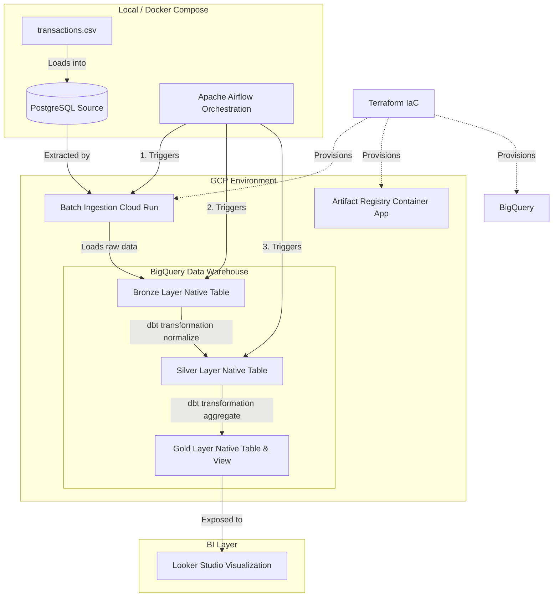

# NTT End-to-End Data Pipeline (DE - AE - DA)

This repository contains the structured components for an end-to-end data pipeline running on Google Cloud Platform (GCP) and orchestrated locally or via Cloud Composer using Apache Airflow.

## Architecture Overview

## Repository Structure

- `local_db/`: Simulated source transactional database setup (PostgreSQL and CSV data).
- `terraform/`: Infrastructure as Code (IaC) to provision BigQuery datasets, Cloud Run, Artifact Registry, and IAM configuration.
- `ingestion/`: Python-based ingestion microservice containerized and run on Cloud Run.
- `dbt_pipeline/`: DBT models for BigQuery (Bronze, Silver, Gold layers).
- `airflow/`: Orchestration DAGs to schedule and coordinate the pipeline.

## Getting Started

*(Detailed setup, local testing, and GCP deployment commands will be documented here as implementation progresses)*
