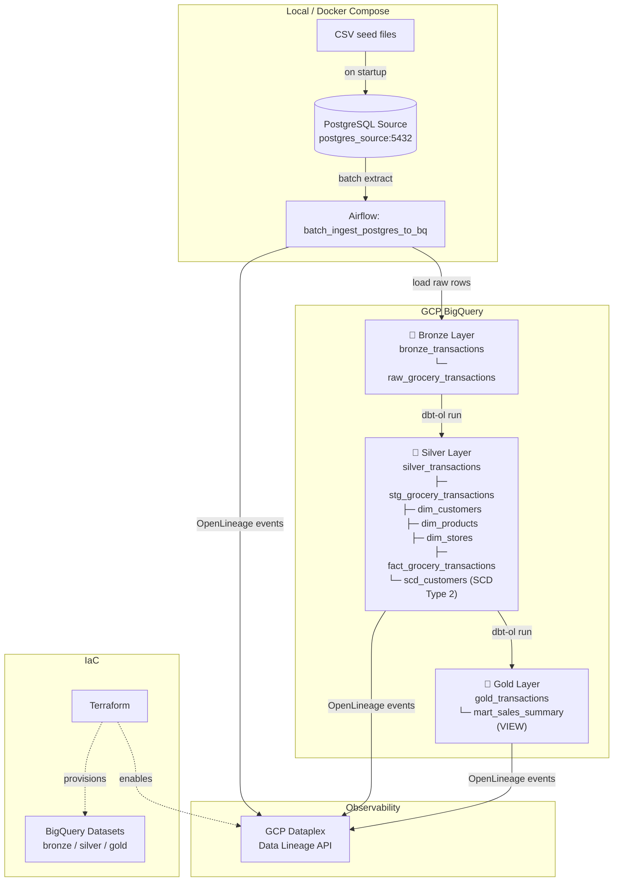

# GCP End-to-End Data Pipeline

A production-grade data engineering project that ingests grocery transaction data from a local PostgreSQL source, transforms it through a Medallion Architecture (Bronze → Silver → Gold) in BigQuery using dbt, and provides full data lineage visibility via GCP Dataplex — all orchestrated by Apache Airflow.

---

## Architecture



---

## Tech Stack

| Layer | Tool | Purpose |
|---|---|---|
| Orchestration | Apache Airflow 2.7 | DAG scheduling & task management |
| Source DB | PostgreSQL 15 (Docker) | Simulated transactional source system |
| Transformation | dbt Core + dbt-bigquery | Medallion layer SQL models |
| Lineage | dbt-ol + openlineage-python | Emit lineage events |
| Data Warehouse | Google BigQuery | Cloud analytics store |
| Observability | GCP Dataplex Data Lineage | Lineage graph visualisation |
| Infrastructure | Terraform | BigQuery datasets & API provisioning |
| Local Dev | Docker Compose | Full local stack (Airflow + Postgres) |

---

## Repository Structure

```
GCP-E2E-DATA-PIPELINE/
├── airflow/
│   └── dags/
│       └── e2e_data_pipeline.py       # Main DAG definition
├── dbt_pipeline/
│   ├── models/
│   │   ├── bronze/                     # stg_grocery_transactions + schema.yml
│   │   ├── silver/                     # dim_*, fact_*, scd_* + schema.yml
│   │   └── gold/                       # mart_sales_summary + schema.yml
│   ├── dbt_project.yml
│   └── profiles.yml.example
├── ingestion/
│   └── src/
│       ├── main.py                     # Batch ingestion script
│       └── tables_config.json          # Source table mapping
├── local_db/
│   ├── data/                           # CSV seed files
│   └── seed.Dockerfile
├── terraform/
│   ├── main.tf                         # BigQuery datasets + Dataplex API
│   ├── variables.tf
│   ├── outputs.tf
│   └── terraform.tfvars.example
├── presentation/
│   ├── index.html                      # Project slide deck
│   └── dashboard.html                  # Sales analytics dashboard
├── docker-compose.yml
├── .env.example                        # ← copy to .env and fill in values
└── openlineage.yml
```

---

## Getting Started

### Prerequisites

- **Docker Desktop** (with Compose v2)
- **Google Cloud SDK** — authenticated with ADC:
  ```bash
  gcloud auth login
  gcloud auth application-default login
  gcloud config set project YOUR_PROJECT_ID
  ```
- **Terraform** ≥ 1.0

### 1. Clone and Configure

```bash
git clone https://github.com/YOUR_USERNAME/GCP-E2E-DATA-PIPELINE.git
cd GCP-E2E-DATA-PIPELINE

# Copy example env file and fill in your GCP project ID
cp .env.example .env
```

Edit `.env` and set `GCP_PROJECT_ID` to your project. Also generate a Fernet key:
```bash
python -c "from cryptography.fernet import Fernet; print(Fernet.generate_key().decode())"
# Paste the output into AIRFLOW__CORE__FERNET_KEY in .env
```

### 2. Provision GCP Infrastructure

```bash
cp terraform/terraform.tfvars.example terraform/terraform.tfvars
# Edit terraform.tfvars with your project_id

cd terraform
terraform init
terraform apply -auto-approve
cd ..
```

This creates three BigQuery datasets (`bronze_transactions`, `silver_transactions`, `gold_transactions`) and enables the Dataplex Lineage API.

### 3. Start the Pipeline

```bash
docker compose up -d
```

On startup this:
1. Launches `postgres_source` and seeds it with grocery transaction data from CSV
2. Starts Airflow (webserver + scheduler + init) with all Python dependencies pre-installed
3. Mounts your ADC credentials (`~/.config/gcloud`) into the Airflow containers

### 4. Trigger the DAG

**Option A — CLI (no UI needed):**
```bash
docker exec airflow_scheduler bash -c \
  "airflow dags unpause ntt_e2e_data_pipeline && \
   airflow dags trigger ntt_e2e_data_pipeline"
```

**Option B — Airflow UI:**
1. Open [http://localhost:8080](http://localhost:8080) (user: `airflow` / pass: `airflow`)
2. Find `ntt_e2e_data_pipeline` → toggle unpause → click **Trigger**

### 5. Monitor

```bash
# Check task states for the latest run
docker exec airflow_scheduler \
  airflow tasks states-for-dag-run ntt_e2e_data_pipeline <RUN_ID>
```

---

## DAG Task Flow

```
start_pipeline
    └── batch_ingest_postgres_to_bq   # Python: extract from PG → load to BigQuery Bronze
            └── copy_dbt_project       # Copies dbt models into container workspace
                    └── dbt_deps       # dbt deps (installs dbt_utils)
                            └── dbt_run_bronze   # dbt-ol run --select stg_grocery_transactions
                                    └── dbt_run_silver   # dbt-ol run --select silver.*
                                            ├── dbt_snapshot_scd   # dbt snapshot (SCD Type 2)
                                            └── dbt_run_gold       # dbt-ol run --select gold.*
                                                    └── end_pipeline
```

---

## Data Models

### Bronze — `bronze_transactions.raw_grocery_transactions`
Raw rows loaded by the ingestion task. Partitioned by `ingestion_date`. One row per product line item per transaction.

### Silver — `silver_transactions`
Star Schema built from the staging table:

| Model | Type | Description |
|---|---|---|
| `stg_grocery_transactions` | Table | Cleaned/cast staging model |
| `dim_customers` | Table | One row per customer (MD5 surrogate key) |
| `dim_products` | Table | One row per product + aisle combo |
| `dim_stores` | Table | One row per store |
| `fact_grocery_transactions` | Incremental Table | Central fact table (partitioned + clustered) |
| `scd_customers` | Snapshot | SCD Type 2 customer history |

### Gold — `gold_transactions.mart_sales_summary`
Business-ready VIEW joining all Silver tables. Aggregated daily KPIs by store × product × date:
- `total_transactions`, `total_items_sold`
- `total_revenue`, `total_discount`, `net_revenue`
- `avg_basket_value`, `total_loyalty_pts`

---

## Data Lineage

OpenLineage events are emitted to GCP Dataplex after each pipeline task. View the full lineage graph in:

**GCP Console → Dataplex → Catalog → Lineage**

The lineage traces the full path:
```
postgres://postgres_source → BigQuery:bronze → BigQuery:silver → BigQuery:gold
```

---

## Dashboard

Open `presentation/dashboard.html` in a browser for an interactive sales analytics dashboard built from the `mart_sales_summary` schema (simulated data).

---

## License

MIT — see [LICENSE](LICENSE)
