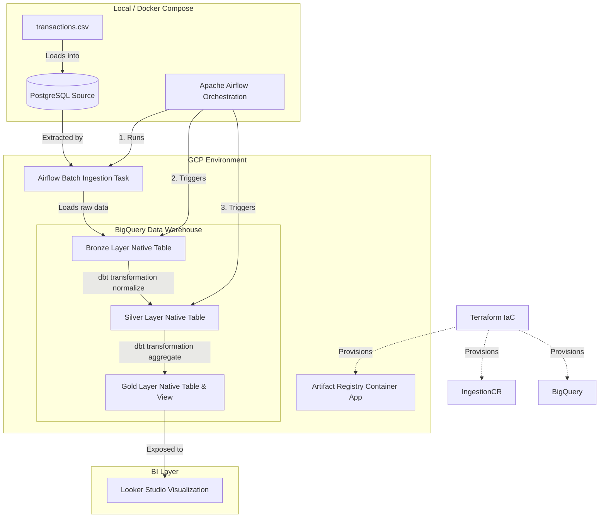

# NTT End-to-End Data Pipeline (DE - AE - DA)

This repository contains the structured components for an end-to-end data pipeline running on Google Cloud Platform (GCP) and orchestrated locally or via Cloud Composer using Apache Airflow.

## Architecture Overview



## Repository Structure

- `local_db/`: Simulated source transactional database setup (PostgreSQL and CSV data).
- `terraform/`: Infrastructure as Code (IaC) to provision BigQuery datasets and Artifact Registry. Cloud SQL is intentionally not provisioned; local PostgreSQL is the source system.
- `ingestion/`: Python-based batch ingestion module. It can be containerized as a microservice, and locally Airflow runs it directly.
- `dbt_pipeline/`: DBT models for BigQuery (Bronze, Silver, Gold layers).
- `airflow/`: Orchestration DAGs to schedule and coordinate the pipeline.

## Getting Started

### 1. Prerequisites
Ensure you have the following installed locally:
* **Docker** and **Docker Compose**
* **Google Cloud SDK (gcloud)** authenticated with Application Default Credentials:
  ```bash
  gcloud auth login
  gcloud auth application-default login
  ```

### 2. Infrastructure Provisioning
Provision GCP BigQuery datasets and Artifact Registry:
```bash
cd terraform
terraform init
terraform apply -auto-approve
```

### 3. Running the Pipeline Locally
1. Start the Docker Compose services (source PostgreSQL, seed job, and Apache Airflow):
   ```bash
   docker-compose up -d
   ```
2. The source PostgreSQL database is exposed on host port `5433` and is reachable inside Docker as `postgres_source:5432` with user/password `postgres` / `postgres_password`.
3. On startup, Airflow dynamically installs python dependencies (`dbt-bigquery`, `google-cloud-bigquery`, `pandas`, etc.) and mounts the local workspace.
4. Access the Airflow UI at **http://localhost:8080** (Username/Password: `airflow` / `airflow`).
5. Unpause and trigger the `ntt_e2e_data_pipeline` DAG. This runs:
   - **`trigger_batch_ingestion`**: Runs `ingestion/src/main.py` in Airflow, pulls data from local Postgres, authenticates to GCP with mounted Application Default Credentials, and loads raw data into BigQuery.
   - **`dbt_run_bronze`**: Standardizes fields and creates staging table.
   - **`dbt_run_silver`**: Cleans, upper-cases payment methods, and deduplicates records.
   - **`dbt_run_gold`**: Creates an aggregated reporting view.

---

## BigQuery Data Schema

The dbt transformations compile and load the following datasets in GCP:
* **Bronze Layer**: `bronze_transactions.stg_transactions` (Staged raw transactions)
* **Silver Layer**: `silver_transactions.int_transactions_normalized` (Normalized and deduplicated records)
* **Gold Layer**: `gold_transactions.fct_transactions_summary` (Aggregated view by store location, product category, and payment method)

---

## BI Layer: Looker Studio Connection

To visualize the gold view in Looker Studio:
1. Open [Looker Studio](https://lookerstudio.google.com/).
2. Click **Create** > **Data Source**.
3. Select the **BigQuery** connector.
4. Select your **GCP Project** (`e2e-data-pipeline-497509`).
5. Choose the **Dataset** `gold_transactions`.
6. Select the **View** `fct_transactions_summary` and click **Connect**.
7. Create your dashboard using dimensions:
   - `store_location`
   - `product_category`
   - `payment_method`
   - `transaction_date`
   And metrics:
   - `total_transactions` (sum)
   - `total_revenue` (sum)
   - `average_order_value` (average)
